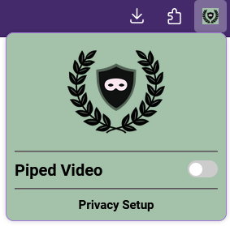
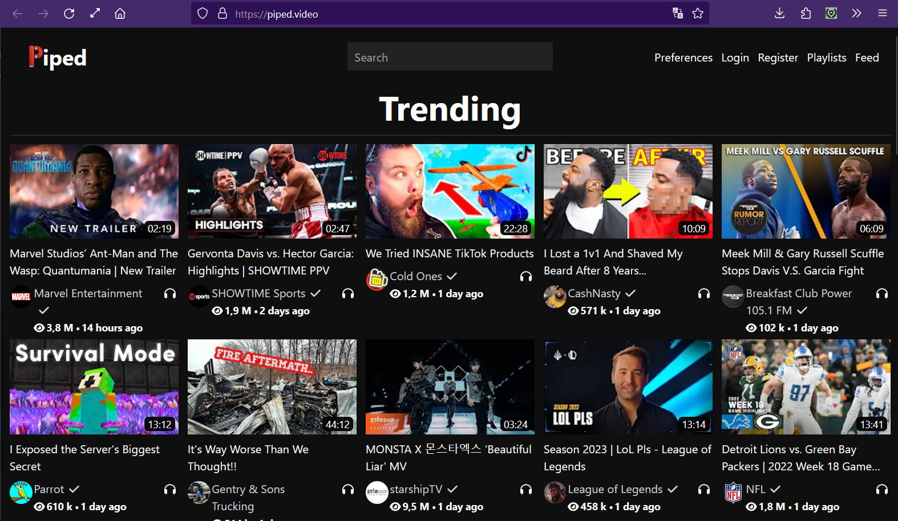
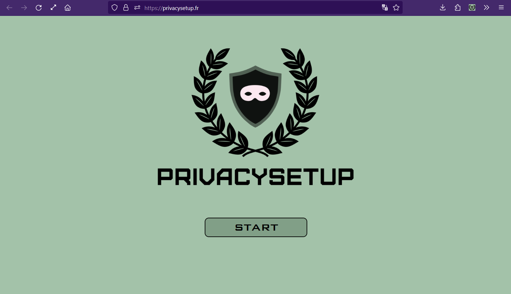

<p align="center">
    
</p>
<p align="center">
    
    
</p>


# Introduction
PrivacySetup-Add is an extension create after the web site [privacysetup.fr](https://privacysetup.fr) to upgrade your privacy online.\
Actually, only one functionality is available: Skipping YouTube to Piped Video.

NB:\
Only supported by Firefox v108 and more.

## Visuals 📸




## Installation 💻

Two options are possible :\
▪️Intall the last release on [Firefox](https://addons.mozilla.org/fr/firefox/addon/privacy-setup/).\
▪️Make your own by zipping the files.

### I make my own 😎
Zip the items together as the following example  :

```bash
PrivacySetup-Add.zip/

  img/
    PS.png
    PS-96.png

  popup/
    window-action.json
    window-style.css
    window.html

  manifest.json
  catch.js
  LICENSE
  README.md


```

## Usage

Use this Firefox extension to never have to watch a video on YouTube and preserve your privacy.

## Support

You can contact me at [contact@privaysetup.fr](mailto:contact@privacysetup.fr "Contact").

## Roadmap 🎯

▪️Enable and disable the extension.\
▪️Create more automated alternatives.\
▪️Make it available in Chrome.

## Contributing

Pull requests are welcome. For major changes, please open an issue first
to discuss what you would like to change.

Please make sure to update tests as appropriate.

## Authors and acknowledgment
Made by Largo CATALÃO ([@larg0c](https://github.com/larg0c))

## License

[Mozilla Public License Version 2.0](http://mozilla.org/MPL/2.0/)
